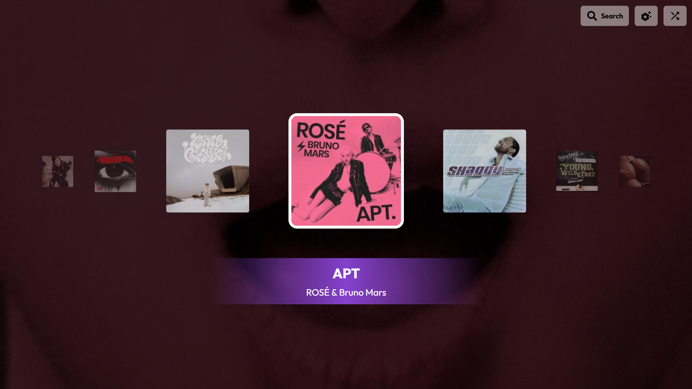
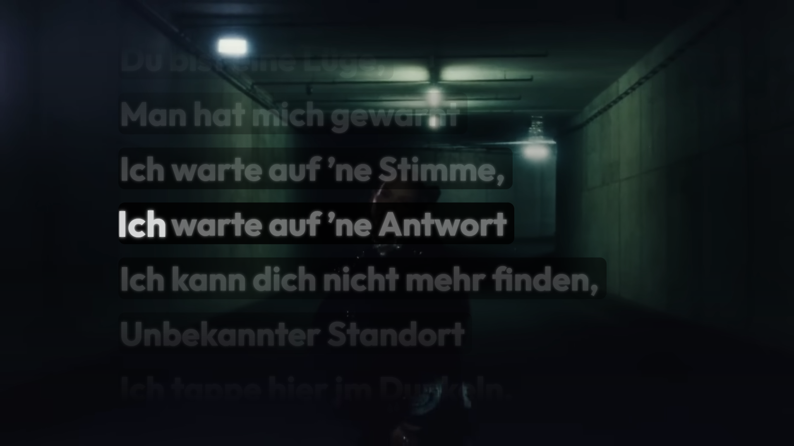

# vibes

|      Song Carousel      |      Lyrics Player      |
| :---------------------: | :---------------------: |
|  |  |

_vibes_ is a small karaoke application that plays text files synchronized to the UltraStar format. It interfaces with community databases like USDB Animux and utilizes yt-dlp in the background to stream publicly available media.

**Disclaimer**: Vibes is a client-side tool only. It does not host, distribute, or own any media files or song lyrics. All content is fetched dynamically from third-party sources. Users are responsible for complying with the Terms of Service of any accessed platforms and ensuring they have the legal right to use the respective audio and video files.

## Installation

Vibes provides first hand support for Windows. MacOS and Linux are also supported but may be less stable. You can download the latest release from the [releases page](https://github.com/harrydehix/vibes/releases).

### Troubleshooting

If you aren't able to download any songs try to restart the application. Most of the time this fixes the problem. If that doesn't work, make sure you have yt-dlp installed and that it's in your system's PATH. You can check if yt-dlp is installed by running `yt-dlp --version` in your terminal or command prompt. If it's not installed, you can download it from the [yt-dlp GitHub repository](https://github.com/yt-dlp/yt-dlp).

Problems with starting the application on mac are propably caused by my missing developer id. You have to self sign the app by using `sudo codesign --force --deep --sign "LocalCertificate" /Applications/vibes.app
`.

### Auto updates

Once installed vibes will automatically check for updates on startup and install the latest version on restart. Your currently installed version will be displayed in the start screen's bottom left corner.

## Usage Tips

### Keyboard Shortcuts for the Lyrics Player

Use `C` to toggle an additional background to make the lyrics more readable.

Use `ArrowUp` and `ArrowDown` to change the sync time of the lyrics dynamically if they are not perfectly in sync with the music while playing a song.

Use `Esc` to open the pause menu. From there you can restart the song, go back to the song list, change settings or quit the app.

### Keyboard Shortcuts for the Song Carousel

Use `ArrowLeft` and `ArrowRight` to navigate the song list. Press `Enter` to play the selected song.

Use `Esc` to quit the app.

### Controller Support

Controllers aren't fully supported yet. Some basic actions like play/pause and navigating the song list work, but more complex interactions aren't fully implemented yet.
